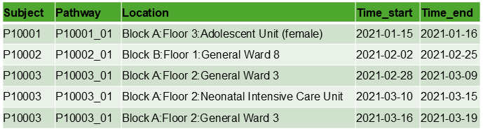
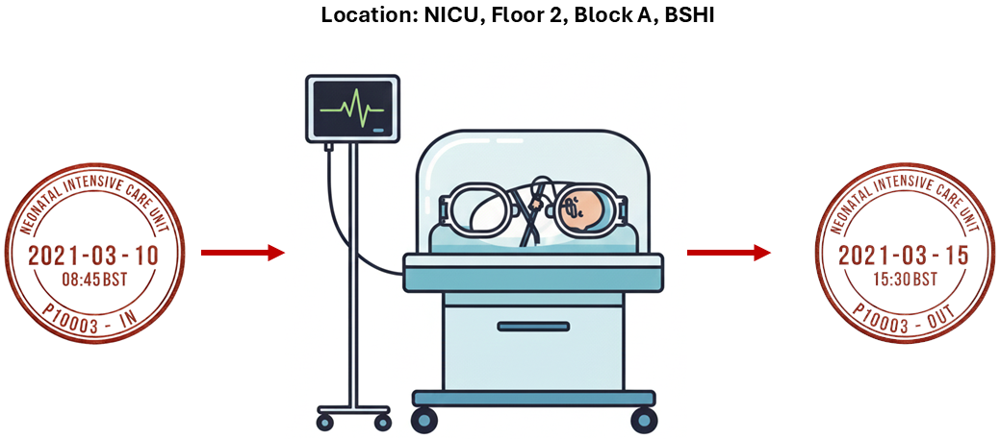
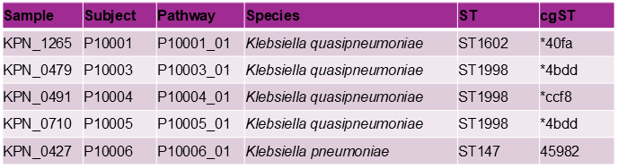
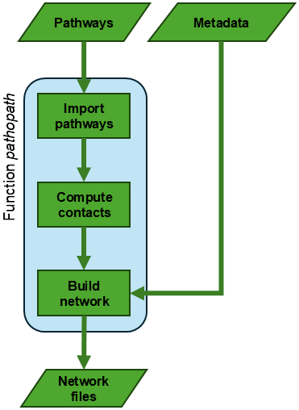
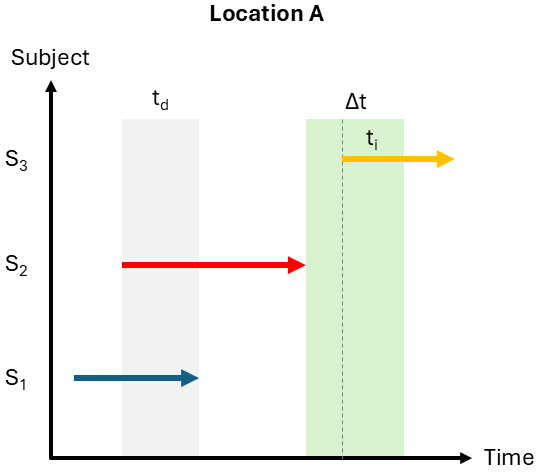

# Pathopath

**Patho**gen **Path**ways (PathoPath) is an R package determining direct and indirect contacts between movement pathways of subjects and building a contact network accordingly. It was developed for tracing transmission of pathogens. Subjects include patients, animals, inanimate objects, and so forth. In hospital settings, each pathway consists of all movements of a patient within a relevant healthcare facility—for instance, a single hospital or hospital network—from admission to discharge.

Strengths of pathopath includes (1) versability—support multiple location levels (Hospital, Building, Floor, Unit, Ward, Room, Bed, *etc*) that can be specified by users; (2) generality—incorporation of patients and inanimate subjects.

## 1. Installation

1. Download the package from [Releases](https://github.com/wanyuac/pathopath/releases) of this GitHub repository (for example, `pathopath_0.0.1.tar.gz`)
2. Install the pathopath package in R using the following command and following prompts to install dependencies (R packages dplyr, readr, fs, stringr, tibble, and purrr) that are not previously installed.

```r
install.packages("pathopath_0.0.1.tar.gz", repos = NULL, type = "source", dependencies = TRUE)
```

## 2. Usage

### 2.1. Load the package

```R
library(pathopath)
```

### 2.2. Where to start?

Users can start with the `pathopath` function. This function integrates other functions of this package into a pipeline. It has a mandatory parameter `movement_table` for input and optional parameters `genotype_table` (default: NULL) and `dt` (default value: 3) for detection of indirect contacts, which can be turned off by specifying `dt = 0`.

```bash
?pathopath  # Read the function's documentation
```

### 2.3. Prepare input files

The main function `pathopath` takes as input two tab-separated values (TSV) files (Figure 1):

* (Mandatory) movement table
* (Optional) sample metadata



**Figure 1**. Example input movement data for the `pathopath` function. Such data can be extracted from electronic health records.

#### 2.3.1. Mandatory movement spreadsheet

The `pathopath` function takes as input a mandatory TSV file reflecting movements. This file comprises five columns *Subject*, *Pathway*, *Location*, *Time_start*, and *Time_end*, and its path of access is provided to the `movements` parameter of the `pathopath` function. Any incorrect names or absence of the mandatory columns will cause the function to stop with an error message.

* **Subject**: unique subject identifiers, for example, anonymised patient IDs  
* **Pathway**: unique pathway identifiers, commonly known as admission accessions in electronic healthcare records  
* **Location**: unique location identifiers. Users can maintain a separate spreadsheet linking these identifiers to any specific location level (Hospital, Building, Floor, Ward, Unit, Bed, _etc_).  
* **Time_start** and **Time_end**: timestamps following the [ISO 8601](https://www.iso.org/iso-8601-date-and-time-format.html) format (YYYY-MM-DD) (Figure 2). Pathopath current only supports dates.  

Users can find [`input_movements_template.tsv`](https://github.com/wanyuac/pathopath/blob/main/vignettes/input_movements_template.tsv) for a template of this input file. Additional columns will not be processed by the function. An example input file is accessible in the vignette directory ([`input_movements.tsv`](https://github.com/wanyuac/pathopath/blob/main/vignettes/input_movements.tsv)), and users can use the template file `template_input_movements.tsv` in the vignette directory for creating the input movement spreadsheet.

##### Recording movements with timestamps



**Figure 2**. Recording movements of subjects by combination of timestamps and location information.

##### Assessment of the quality of input movement data

* `Time_start` must not exceed `Time_end` at each location.
* **Location uniqueness**: Locations within the same movement pathway must be temporally separate, since any subject cannot be in two physical locations at the same time.
* **Pathway integrity**: No time gap between consecutive locations in the same pathway. For example, when timestamps are recorded as dates, Time\_end of the previous location and Time\_start of the next location should differ by at most one day (same date: same-day transfer; differ by one day: next-day transfer).
* **Pathway uniqueness**: Periods of pathways of the same patient must not overlap, in other words, be temporally separate. When timestamps are recorded as dates, the last day of the previous pathway and the first day of the next pathway must differ by at least one day—for example, a patient is discharged on Day 1 and readmitted on Day 2.

#### 2.3.2. Optional spreadsheet of sample metadata

Users can also provide the path of an optional TSV-formatted sample spreadsheet to the `pathopath` function using its `samples` parameter. This file comprises three mandatory columns (*Sample*, *Subject*, and *Pathway*) followed by additional data columns of any R-compatible names.

This sample spreadsheet will be merged into the output network as node attributes (see function `create_network`). Sample data of subjects or pathways that are not present in the network will be discarded.



**Figure 3**. Example input sample metadata for the `pathopath` function.

### 2.4. Use the pathopath function

```R
pp <- pathopath(movements = "vignettes/input_movements.tsv", samples = "vignettes/input_samples.tsv", dt = 3)
```

Users can find `demo.R` and example output files in the [vignettes](https://github.com/wanyuac/pathopath/tree/main/vignettes) directory for further details.

#### 2.4.1. Workflow



**Figure 4**. Workflow of the `pathopath` function.

#### 2.4.2. Definition of contacts



**Figure 5**. Definition of direct and indirect contacts between three subjects S<sub>1</sub>, S<sub>2</sub>, and S<sub>3</sub>. The time of a direct contact and indirect contact is denoted by t<sub>d</sub> and t<sub>i</sub>, respectively, while Δt denotes the `dt` parameter of the `pathopath` function.

### 2.5. Access the output

The `pathopath` function returns an S4 Pathopath object, which comprises six data slots that can be accessed using the `@` operator (*e.g.*, `pp@contacts`) or the `slot()` function in base R \[*e.g.*, `slot(pp, "contacts")`\]. An example output can be accessed in the vignette directory ([`pp.rds`](https://github.com/wanyuac/pathopath/blob/main/vignettes/output_pp.rds)). These slots are explained below.

* **pathways**: a list of tibbles (compatible with data frames) and named by subject identifiers. So the length of this list equals the number of unique subjects in the input TSV file. Each tibble consists of four columns—Pathway, Location, Time_start, and Time_end—from the input file. Note that the tibble of an subject may contain two or more pathways. Example data file: [`output_pathways.rds`](https://github.com/wanyuac/pathopath/blob/main/vignettes/output_pathways.rds) (use command `pathways <- readRDS("vignette/pathways.rds")` to load it into your R environment).
* **migrations**: a tibble counting the number of location changes (migrations) in each pathway and reporting the start and end time of each pathway. It consists of five columns: Subject, Pathway, Migrations, Time_start,  and Time_end. Example: [`output_migrations.tsv`](https://github.com/wanyuac/pathopath/blob/main/vignettes/output_migrations.tsv).
* **contacts**: a tibble of 15 columns reporting contact status (Direct/Indirect/None) between any pair of pathways at each shared location. The Length column consists of the lengths of contacts measured by days. Note that two pathways may have a direct contact at a location and an indirect contact at another location. Example: [`output_contacts.tsv`](https://github.com/wanyuac/pathopath/blob/main/vignettes/output_contacts.tsv). This tibble is perhaps the most pivotal output from pathopath, because users can customise contact networks using this tibble.
* **summary**: a tibble of 10 columns reporting the total number, length, and location numbers of direct and indirect contacts between pathways. Example: [`output_contact_summary.tsv`](https://github.com/wanyuac/pathopath/blob/main/vignettes/output_contact_summary.tsv).
* **network**: an S4 Network object comprising two slots of tibbles: V for the node table and E for the edge table compatible with network visualisation in [Cytoscape](https://cytoscape.org/). Example: [`output_network_nodes.tsv`](https://github.com/wanyuac/pathopath/blob/main/vignettes/output_network_nodes.tsv) for V (`pp@network@V`) and [`output_network_edges.tsv`](https://github.com/wanyuac/pathopath/blob/main/vignettes/output_network_edges.tsv) for E (`pp@network@E`).
* **parameters**: a named list storing parameters (pathways, genotypes, dt) of the pathopath function for reproducibility and recalculation for contacts.

### 2.6. Detach the package after use

```R
detach(name = "package:pathopath", unload = TRUE)  # The package can be reloaded using the library() function.

remove.packages("pathopath")  # Use this command to delete the package
```

## 3. Helper functions

#### 3.1. Overview

The functions are components of the `pathopath` function, and they can be used separately for exploration.

* `read_pathways(movement_table, count_migrations = TRUE)` imports the input TSV file of the `pathopath` function.
* `compute_contacts(pathways, dt = 3)` detects and quantifies direct and indirect contacts.
* `create_network(contact_summary, genotypes)` converts a contact-summary table into a network object.
* `assess_pathways(pathways)` evaluates the quality of movement data under three criteria (location uniqueness, pathway integrity, and pathway uniqueness) described in the previous Subsection "Assessment of the quality of input movement data".
* `add_movements(movements = NULL, samples = NULL, previous_results = NULL)`: Incorporates additional patient movements into existing results without recomputing contacts.

#### 3.2. An example of incorrect input pathway data

Command `incorrect_pathways <- read_pathways(movement_table = "vignettes/input_movements_with_mistakes.tsv")` in `vignettes/demo.R` demonstrates some error messages from function `assess_pathways` when handling input data with erroneous  pathway information:

* Lines 6–7: Time gap between 2021-08-25 and 2021-08-27 when patient P02 moved from location Bld1:F1:W10 to Bld1:F1:W03 in pathway P02\_02.
* Line 30: time start (2021-12-25) > time end (2021-12-17) for Patient P20's presence at location Bld1:F1:W04.

The error messages are:

```text
Error in read_pathways(movement_table = "vignettes/input_movements_with_mistakes.tsv") : 
  Error: one or multiple incorrect pathways are identified.
In addition: Warning messages:
1: Error: at least one time gap between consecutive locations are identified in pathway P02_02 of subject P02. 
2: Error: Time_start at location Bld1:F1:W04 in pathway P20_01 of subject P20 exceeds Time_end. 
3: Error: at least one time gap between consecutive locations are identified in pathway P02_02 of subject P20. 
```

## 4. FAQs

### 4.1. What if some subjects have more than one microbiological samples?

Users can create customised networks from such sample data and the contact table in pathopath's output (slot `@contacts`) to incorporate additional sample information.

### 4.2. Do pathway identifiers have to be unique across the input data?

No, although it is a good practice to make pathway identifiers unique across the input data. Nonetheless, pathway identifiers must be unique for pathways of the same subject.

## 5. Appendix

### 5.1. Citation

Wan Y, Sajib MSI. Pathopath. https://github.com/wanyuac/pathopath (2025).

### 5.2. Funding sources

* NIHR Global Health Research Development Award to the Child Health Research Foundation in Bangladesh.
* David Price Evans Research Fellowship to Yu Wan.
* Centres for Antimicrobial Optimisation Network (CAMO-Net) Research Fellowship to Mohammad Saiful Islam Sajib.

