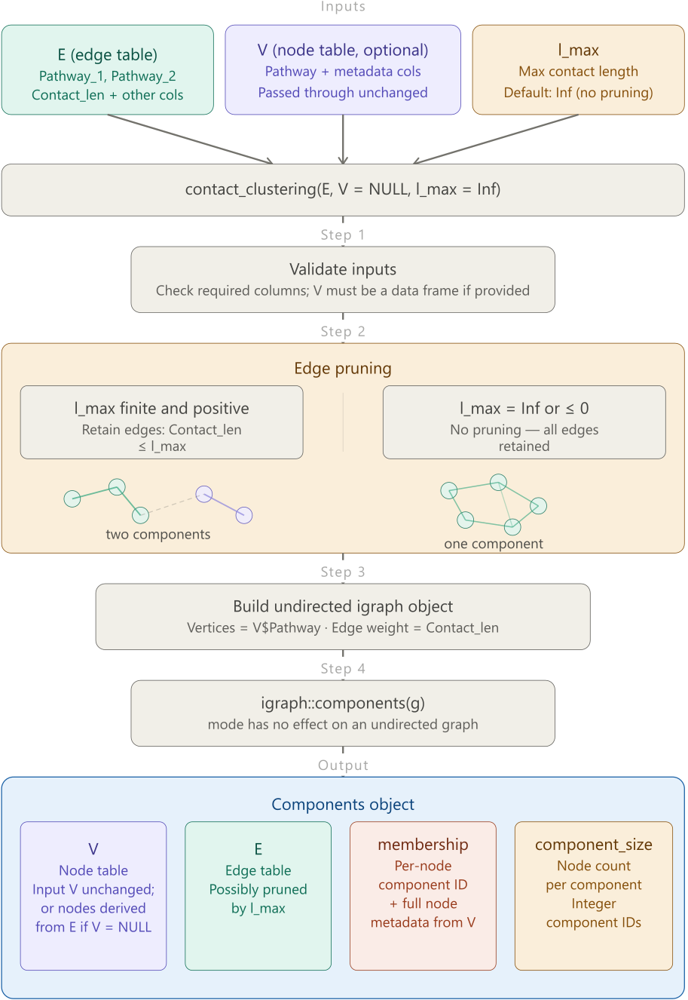
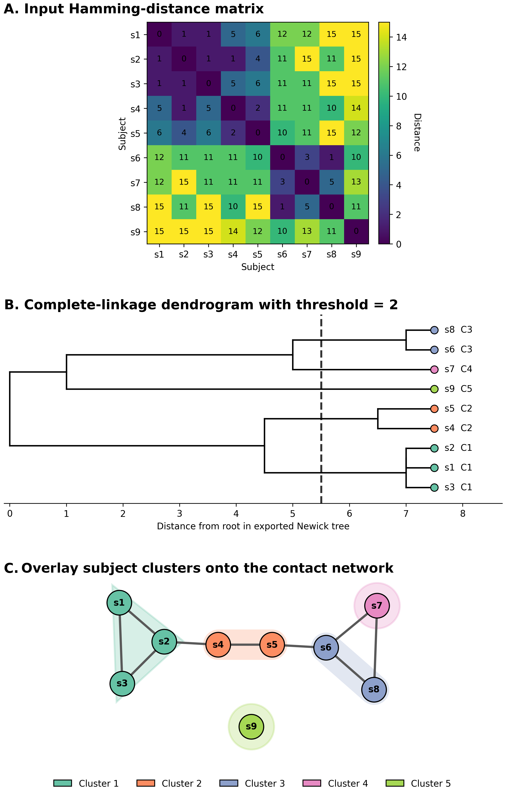
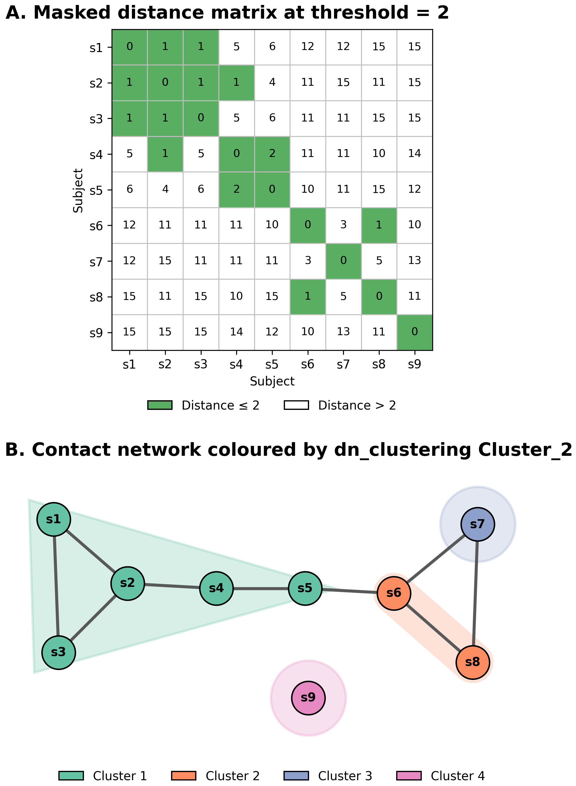

# PathoPath: integrative modelling of pathogen transmission pathways


**Patho**gen **Path**ways (PathoPath or Pathopath) is an open-source R package for integrative modelling of pathogen transmission via direct or indirect contacts between movement pathways of subjects, facilitating epidemiological investigation and surveillance, including monitoring regional transmission of certain pathogens. Contributions to the code are welcome.


**Table of Contents**

1. [Overview](#overview)
   * [What PathoPath enables](#functionality)
   * [Major innovations](#major-innovations)
   * [Limitations](#limitations)
   * [Citation](#citation)
2. [Deployment](#deployment)
   * [Prerequisites](#prerequisites)
   * [Installation](#installation)
3. [Usage (step-by-step commands)](#usage)
   * [Load the package](#load)
   * [The main function](#main-function)
   * [Prepare input files](#inputs)
   * [Use the pathopath function](#pathopath-function)
   * [Access the output](#outputs)
   * [Interpret the network](#interpret-network)
   * [Component identification](#component-identification)
   * [Node clustering with pathogen characteristics](#node-clustering)
   * [Detach the package after use](#detach)
   
4. [Helper functions](#helper-functions)
   * [Overview](#helpers-overview)
   * [An example of incorrect input pathway data](#input-qc)
   
5. [FAQs](#faqs)
6. [Funding information](#funding)


## 1. Overview<a id="overview"></a>

### 1.1. What PathoPath enables<a id="functionality"></a>

1. Construction of a network from direct and/or indirect contacts,
2. Incorporation of configurable pathogen characteristics (for instance, genotypes and genetic clusters) as node attributes in the contact network.
3. An open platform for customised investigations and local adaptation for users' own data dashboards—teamwork and local capacity-building are essential for a successful implementation of PathoPath in a specific setting. Please contact us (either by email or requests on [Issues](https://github.com/wanyuac/pathopath/issues)) if you need any assistance.

### 1.2. Major innovations<a id="major-innovations"></a>

1. A generalised scope: PathoPath has extended beyond our conventional focus on patients to a generalised concept of *subjects*, which include patients, animals, inanimate objects, and so forth. In hospital settings, each pathway consists of all movements of a patient within a relevant healthcare facility, such as a hospital or network of hospitals, from admission to discharge.
2. Threshold-based inference of indirect contacts: PathoPath uses a user-defined parameter Δt to infer indirect contacts. This parameter represents the user's belief about the length of time in which a contaminated subject (e.g, a bed) remains contagious.

### 1.3. Limitations<a id="limitations"></a>

1. PathoPath does not provide any graphical user interface (GUI), which may be created with the [Shiny](https://shiny.posit.co/) package, since we encourage users to develop their own GUIs that cooperate with local information-management systems for specific needs.
2. It does not infer directions of transmission.
3. As a research tool, PathoPath may misbehave in your analysis, so please use it with caution. A local validation of this tool in your setting is desirable. We will sincerely appreciate your critiques or report of any issue in the [Issues](https://github.com/wanyuac/pathopath/issues) section and will work together to solve these problems. Suggestions for new functions are also welcome.

### 1.4. Citation<a id="citation"></a>

Sajib MS, Tanmoy AM, Kanon N, et al. Integrating patient movement and pathogen genomics to support hospital infection prevention with PathoPath: a method development study. medRxiv 2026; : 2026.06.03.26354630. https://doi.org/10.64898/2026.06.03.26354630.


## 2. Deployment<a id="deployment"></a>

### 2.1. Prerequisites<a id="prerequisites"></a>

* An [R](https://cran.r-project.org/) code interpreter—the latest version is recommended.
* R packages dplyr, readr, fs, stringr, purrr, tibble, igraph, and ape
* Data: complete records (electronic or paper-based) of subject movements

Optional software:

* [Cytoscape](https://cytoscape.org/) for network visualisation
* [RStudio IDE](https://posit.co/products/open-source/rstudio) for coding, debugging, and data analysis

### 2.2. Installation<a id="installation"></a>

1. Download the package from [Releases](https://github.com/wanyuac/pathopath/releases) of this GitHub repository (for example, `pathopath_0.0.5.tar.gz`)
2. Install the pathopath package in R using the following command and following prompts to install dependencies (R packages dplyr, readr, fs, stringr, tibble, and purrr) that are not previously installed.

```r
install.packages("pathopath_0.0.5.tar.gz", repos = NULL, type = "source", dependencies = TRUE)
```


## 3. Usage<a id="usage"></a>

### 3.1. Load the package<a id="load"></a>

```R
library(pathopath)
```

### 3.2. Where to start—the main function<a id="main-function"></a>

Users can start with the `pathopath` function. This function integrates other functions of this package into a pipeline. It has a mandatory parameter `movement_table` for input and optional parameters `genotype_table` (default: NULL) and `dt` (default value: 3) for detection of indirect contacts, which can be turned off by specifying `dt = 0`.

```bash
?pathopath  # Read the function's documentation
```

### 3.3. Prepare input files<a id="inputs"></a>

The main function `pathopath` takes as input two tab-separated values (TSV) files (Figure 1):

* (Mandatory) movement table
* (Optional) sample metadata


**Figure 1**. Example input movement data for the `pathopath` function. Such data can be extracted from electronic health records.

#### 3.3.1. Mandatory movement spreadsheet

The `pathopath` function takes as input a mandatory TSV file reflecting movements. This file comprises five columns *Subject*, *Pathway*, *Location*, *Time_start*, and *Time_end*, and its path of access is provided to the `movements` parameter of the `pathopath` function. Any incorrect names or absence of the mandatory columns will cause the function to stop with an error message.

* **Subject**: unique subject identifiers, for example, anonymised patient IDs  
* **Pathway**: unique pathway identifiers, commonly known as admission accessions in electronic healthcare records  
* **Location**: unique location identifiers. Users can maintain a separate spreadsheet linking these identifiers to any specific location level (Hospital, Building, Floor, Ward, Unit, Bed, _etc_).  
* **Time_start** and **Time_end**: timestamps following the [ISO 8601](https://www.iso.org/iso-8601-date-and-time-format.html) format (YYYY-MM-DD) (Figure 2). PathoPath current only supports dates.  

Users can find [`input_movements_template.tsv`](https://github.com/wanyuac/pathopath/blob/main/vignettes/input_movements_template.tsv) for a template of this input file. Additional columns will not be processed by the function. An example input file is accessible in the vignette directory ([`input_movements.tsv`](https://github.com/wanyuac/pathopath/blob/main/vignettes/input_movements.tsv)), and users can use the template file `template_input_movements.tsv` in the vignette directory for creating the input movement spreadsheet.

##### Recording movements with timestamps


**Figure 2**. Recording movements of subjects by combination of timestamps and location information.

##### Assessment of the quality of input movement data

* (1) **Temporal order**: `Time_start` must not exceed `Time_end` at each location.
* (2) **Pathway integrity**: No time gap between consecutive locations in the same pathway. For example, when timestamps are recorded as dates, Time\_end of the previous location and Time\_start of the next location should differ by at most one day (same date: same-day transfer; differ by one day: next-day transfer).
* (3) **Pathway uniqueness**: Periods of pathways of the same patient must not overlap, in other words, be temporally separate. When timestamps are recorded as dates, the last day of the previous pathway and the first day of the next pathway must differ by at least one day—for example, a patient is discharged on Day 1 and readmitted on Day 2.
* (4) **Location uniqueness**: Locations within the same movement pathway must be temporally separate, since any subject cannot be in two physical locations at the same time. Note that this criterion is satisfied when both criteria (1) and (2) satisfy.

#### 3.3.2. Optional spreadsheet of sample metadata

Users can also provide the path of an optional TSV-formatted sample spreadsheet to the `pathopath` function using its `samples` parameter. This file comprises three mandatory columns (*Sample*, *Subject*, and *Pathway*) followed by additional data columns of any R-compatible names.

This sample spreadsheet will be merged into the output network as node attributes (see function `create_network`). Sample data of subjects or pathways that are not present in the network will be discarded.


**Figure 3**. Example input sample metadata for the `pathopath` function.

### 3.4. Use the pathopath function<a id="pathopath-function"></a>

```R
pp <- pathopath(movements = "vignettes/input_movements.tsv", samples = "vignettes/input_samples.tsv", dt = 3)
```

Users can find `demo.R` and example output files in the [vignettes](https://github.com/wanyuac/pathopath/tree/main/vignettes) directory for further details.

#### 3.4.1. Workflow


**Figure 4**. Workflow of the `pathopath` function.

#### 3.4.2. Definition of contacts


**Figure 5**. Definition of direct and indirect contacts between three subjects S<sub>1</sub>, S<sub>2</sub>, and S<sub>3</sub>. The time of a direct contact and indirect contact is denoted by t<sub>d</sub> and t<sub>i</sub>, respectively, while Δt denotes the `dt` parameter of the `pathopath` function.

### 3.5. Access the output<a id="outputs"></a>

The `pathopath` function returns an S4 PathoPath object, which comprises six data slots that can be accessed using the `@` operator (*e.g.*, `pp@contacts`) or the `slot()` function in base R \[*e.g.*, `slot(pp, "contacts")`\]. An example output can be accessed in the vignette directory ([`pp.rds`](https://github.com/wanyuac/pathopath/blob/main/vignettes/output_pp.rds)). These slots are explained below.

* **pathways**: a list of tibbles (compatible with data frames) and named by subject identifiers. So the length of this list equals the number of unique subjects in the input TSV file. Each tibble consists of four columns—Pathway, Location, Time_start, and Time_end—from the input file. Note that the tibble of an subject may contain two or more pathways. Example data file: [`output_pathways.rds`](https://github.com/wanyuac/pathopath/blob/main/vignettes/output_pathways.rds) (use command `pathways <- readRDS("vignette/pathways.rds")` to load it into your R environment).
* **migrations**: a tibble counting the number of location changes (migrations) in each pathway and reporting the start and end time of each pathway. It consists of five columns: Subject, Pathway, Migrations, Time_start,  and Time_end. Example: [`output_migrations.tsv`](https://github.com/wanyuac/pathopath/blob/main/vignettes/output_migrations.tsv).
* **contacts**: a tibble of 15 columns reporting contact status (Direct/Indirect/None) between any pair of pathways at each shared location. The Length column consists of the lengths of contacts measured by days. Note that two pathways may have a direct contact at a location and an indirect contact at another location. Example: [`output_contacts.tsv`](https://github.com/wanyuac/pathopath/blob/main/vignettes/output_contacts.tsv). This tibble is perhaps the most pivotal output from pathopath, because users can customise contact networks using this tibble.
* **summary**: a tibble of 10 columns reporting the total number, length, and location numbers of direct and indirect contacts between pathways. Example: [`output_contact_summary.tsv`](https://github.com/wanyuac/pathopath/blob/main/vignettes/output_contact_summary.tsv).
* **network**: an S4 Network object comprising two slots of tibbles: V for the node table and E for the edge table compatible with network visualisation in Cytoscape. Example: [`output_network_nodes.tsv`](https://github.com/wanyuac/pathopath/blob/main/vignettes/output_network_nodes.tsv) for V (`pp@network@V`) and [`output_network_edges.tsv`](https://github.com/wanyuac/pathopath/blob/main/vignettes/output_network_edges.tsv) for E (`pp@network@E`).
* **parameters**: a named list storing parameters (pathways, genotypes, dt) of the pathopath function for reproducibility and recalculation for contacts.

### 3.6. Interpret the output network<a id="interpret-network"></a>

The `pathopath` function creates a network of contacts between movement pathways from the summary table (tibble) in outputs.

In this network:

* Nodes represent pathways
* Edges represent direct and/or indirect contacts.
* Edge attributes include the total length (duration), number, and count of distinct locations of each contact between two pathways.

In the simplest scenario, where each subject has a single pathway (as demonstrated in our manuscript),  the nodes are equivalent to subjects, and thereby the network depicts contacts between these subjects.

### 3.7. Component identification—clustering of nodes in the contact network by contact lengths<a id="component-identification"></a>

As demonstrated in our manuscript, function `contact_clustering` identifies maximal connected components in the contact network based on contact lengths, optionally after pruning edges whose lengths exceed a user-specified maximum, `l_max` (Figure 6).

Internally, this function constructs an undirected igraph object from a node table `V` and an edge table `E`, which can be supplied directly from `pp@network@V` and `pp@network@E`, respectively, where `pp` is an output of the main function `pathopath`. Edge pruning is applied when `l_max` is a finite positive value, retaining only edges with `Contact_len <= l_max`; nodes that become isolated following pruning are included in the network as singletons. Connected components are then identified in the network using the `igraph::components()` function. Finally, the `contact_clustering` function returns a `Components` object comprising four slots:

* `V` and `E` for the nodes and edges of the possibly pruned network,
* `membership` for per-node component assignments (combined with all node-level metadata from `V`),
* `component_size` for the number of nodes in each component.

By varying the cut-off of contact lengths, `l_max`, users can examine how components change for epidemiological insights. Setting a small `l_max` retains only edges representing short contacts, typically yielding a larger number of smaller, more tightly connected components, whereas setting `l_max = Inf` (the default) preserves all edges and reveals the broadest connectivity structure of the contact network.

This clustering approach is conceptually analogous to the pathogen-based component-discovery method implemented in function `dn_clustering` (Section [3.8.2](#dn_clustering)), but operates on contact lengths rather than pairwise Hamming distances between pathogen characteristics. Therefore, it complements the pathogen-based clustering with an epidemiological perspective.

In practice, users may want to filter the edge and node tables for direct or indirect contacts before this clustering analysis if either type of contacts is investigated.



**Figure 6.** The algorithm of contact clustering. Function `contact_clustering` does not filter the input network when `l_max = 0` because there is no practical point to break a network into singletons, which are equivalent to a node table.

Example commands:

```r
# Scenario 1: no edge pruning
contact_clusters <- contact_clustering(E = pp@network@E, V = pp@network@V)  # No edge pruning
View(contact_clusters@membership)
g <- igraph::graph_from_data_frame(d = contact_clusters@E, directed = FALSE, vertices = contact_clusters@V)
plot(g)  # Draw the input network

# Scenario 2: pruning edges for a maximum of contact length of 10 days
contact_clusters_10 <- contact_clustering(E = pp@network@E, V = pp@network@V, l_max = 10)
View(contact_clusters_10@membership)
g_10 <- igraph::graph_from_data_frame(d = contact_clusters_10@E, directed = FALSE, vertices = contact_clusters_10@V)
plot(g_10)  # Draw the pruned network
```

### 3.8. Clustering of nodes in the contact network by pathogen characteristics<a id="node-clustering"></a>

In addition to the clustering of nodes by contact lengths, PathoPath has implemented two clustering methods based on [Hamming distances](https://www.datacamp.com/tutorial/hamming-distance) between pathway-associated pathogen characteristics. Such distances include the widely used core-genome single-nucleotide polymorphism (SNP) distances between bacterial isolates. By definition, the matrix of Hamming distances is symmetric. Both clustering methods require as parameter (`thresholds`) a vector of integer distance thresholds (default: 5, 10, 15, 20, 50) and report clusters determined under each threshold. In addition to user-specified thresholds, both methods determine clusters of identical characteristic profiles (namely, `threshold = 0`, by which genetically identical isolates are clustered), reporting the same result and reflecting the convergence of methods.

#### 3.8.1. Complete-linkage hierarchical clustering

Function `h_clustering` uses [complete-linkage hierarchical clustering](https://en.wikipedia.org/wiki/Complete-linkage_clustering) to classify nodes into clusters (Figure 7), ensuring any pairwise Hamming distance between nodes within the same cluster does not exceed a given threshold. This is a commonly used approach to isolate clustering in epidemiological investigation. For example, a study proposed a conservative cut-off of 15 core-genome SNPs to infer possible transmission of methicillin-resistant *Staphylococcus aureus* (MRSA) within six months ([Coll, Raven, Knight, et al., 2020, *Lancet Microbe*](https://doi.org/10.1016/S2666-5247(20)30149-X)). Function `h_clustering` also produces a dendrogram in the Newick format for visualisation (Figure 6B).



**Figure 7**. Input (A), algorithm (B), and outcome (C) of the complete-linkage hierarchical clustering of nodes in the contact network.

Example commands:

```r
hc <- h_clustering(mat = "vignettes/input_distance_matrix.tsv", thresholds = 2)
View(hc@clusters)  # Show membership of subjects under distance thresholds 0 and 2
View(hc@cluster_counts)  # Show the number of clusters under distance thresholds 0 and 2
plot(hc@tree[["tree"]])  # Draw the dendrogram
```

#### 3.8.2. Component discovery following network pruning<a id="dn_clustering"></a>

Function `dn_clustering` identifies maximal connected components in a distance network that has been pruned to remove edges having distances exceeding a given threshold. This method is more tolerant to stepwise accumulation of divergence in pathogens along transmission chains than the method of complete-linkage hierarchical clustering despite the caveat of transitivity that may result in pairwise Hamming distances greater than the threshold within the same cluster. The prefix "dn" in the function name stands for "distance network".

The algorithm of is method follows (Figure 8).

1. Import a symmetric distance matrix, which is equivalent to an all-to-all network.
2. Mask entries exceeding a given distance cut-off in the matrix, equivalent to edge pruning.
3. Construct a network from remaining distances.
4. Identify maximal connected components in the network.



**Figure 8**. Input distance matrix (A) and the output of function `dn_clustering` (B). In implementation, entries of distances greater than a given threshold (here, 2) are masked as FALSE to be excluded from the network construction.

Example commands:

```r
comp <- dn_clustering(mat = "vignettes/input_distance_matrix.tsv", thresholds = 2)
View(comp@clusters)  # Membership of subjects
View(comp@cluster_counts)  # Number of components under distance thresholds 0 and 2
```

### 3.9. Detach the package after use<a id="detach"></a>

```R
detach(name = "package:pathopath", unload = TRUE)  # The package can be reloaded using the library() function.

remove.packages("pathopath")  # Use this command to delete the package
```


## 4. Helper functions<a id="helper-functions"></a>

### 4.1. Overview<a id="helpers-overview"></a>

The functions are components of the `pathopath` function, and they can be used separately for exploration.

* `read_pathways(movement_table, count_migrations = TRUE)` imports the input TSV file of the `pathopath` function.
* `compute_contacts(pathways, dt = 3)` detects and quantifies direct and indirect contacts.
* `create_network(contact_summary, genotypes)` converts a contact-summary table into a network object.
* `assess_pathways(pathways)` evaluates the quality of movement data under three criteria (location uniqueness, pathway integrity, and pathway uniqueness) described in the previous Subsection "Assessment of the quality of input movement data".
* `add_movements(movements = NULL, samples = NULL, previous_results = NULL)`: Incorporates additional patient movements into existing results without recomputing contacts.

### 4.2. An example of incorrect input pathway data<a id="input-qc"></a>

Command `incorrect_pathways <- read_pathways(movement_table = "vignettes/input_movements_with_mistakes.tsv")` in `vignettes/demo.R` demonstrates some error messages from function `assess_pathways` when handling input data with erroneous  pathway information:

* Lines 6–7: Time gap between 2021-08-25 and 2021-08-27 when patient P02 moved from location Bld1:F1:W10 to Bld1:F1:W03 in pathway P02\_02.
* Line 30: time start (2021-12-25) > time end (2021-12-17) for Patient P20's presence at location Bld1:F1:W04.

The error messages are:

```text
Error in read_pathways(movement_table = "vignettes/input_movements_with_mistakes.tsv") : 
  Error: one or multiple incorrect pathways are identified.
In addition: Warning messages:
1: Error: at least one time gap between consecutive locations are identified in pathway P02_02 of subject P02. 
2: Error: Time_start at location Bld1:F1:W04 in pathway P20_01 of subject P20 exceeds Time_end. 
3: Error: at least one time gap between consecutive locations are identified in pathway P02_02 of subject P20. 
```


## 5. FAQs<a id="faqs"></a>

### 5.1. What if some subjects have more than one microbiological samples?

Users can create customised networks from such sample data and the contact table in pathopath's output (slot `@contacts`) to incorporate additional sample information.

### 5.2. Do pathway identifiers have to be unique across the input data?

No, although it is a good practice to make pathway identifiers unique across the input data. Nonetheless, pathway identifiers must be unique for pathways of the same subject.


## 6. Funding information<a id="funding"></a>

* NIHR Global Health Research Development Award (Grant number: NIHR208273) to the Child Health Research Foundation (CHRF) in Bangladesh.
* Gates Foundation grant (Grant number: INV073135) to the CHRF.
* David Price Evans Research Fellowship to Yu Wan (Grant number: UGG10057; University of Liverpool).
* Centres for Antimicrobial Optimisation Network (CAMO-Net) Research Fellowship to Mohammad Saiful Islam Sajib (Grant number: 226691/Z/22/Z; Wellcome Trust).

